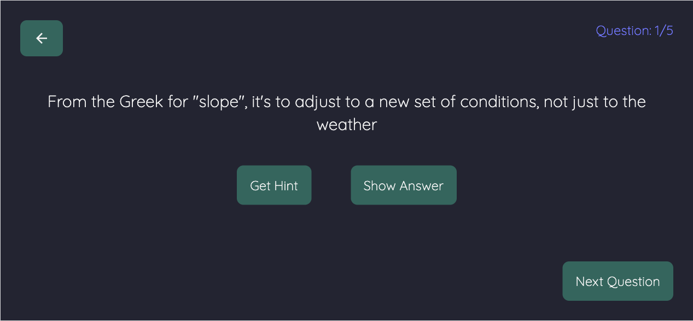

# Getting Started with Create React App

This project was bootstrapped with [Create React App](https://github.com/facebook/create-react-app) and designed with a mobile first approach.

## Technologies used
- React
- Tailwindcss
- React hooks
- TDD (RTL)
- API calls (Axios)

## Available Scripts
### `npm start`
Runs the app in the development mode. Open [http://localhost:3000](http://localhost:3000) to view it in your browser.

### `npm test`
Launches the test runner in the interactive watch mode.
See the section about running tests for more information.

## Screenshots

## Roadmap
- [ ] Make all API calls on game start, filter through object on next question
- [ ] Add another category type
- [ ] Error messages
- [ ] More testing for Questions component and routing

## Acknowledgements

All data from the jService API - [jService repo](https://github.com/sottenad/jService)

